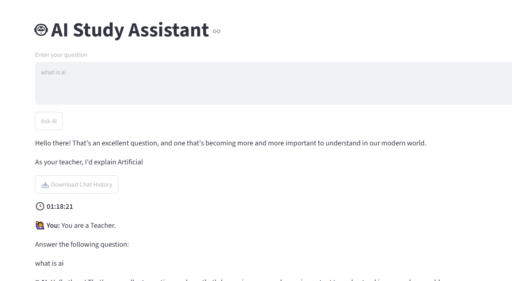
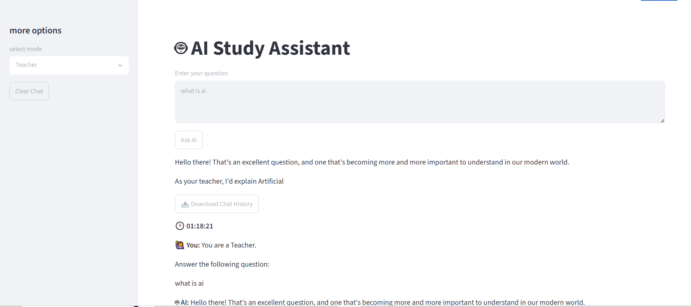

# 🤖 AI Study Assistant

An AI-powered Study Assistant built with **Streamlit** and the **Google Gemini API**. The application helps users ask questions in different modes such as **Teacher**, **Coder**, and **Creative Writer**, while maintaining chat history and allowing it to be downloaded.

---

## 🚀 Features

* 🤖 Powered by Google Gemini 2.5 Flash
* 👨‍🏫 Teacher Mode
* 💻 Coder Mode
* ✍️ Creative Writer Mode
* 🌡️ Different temperature settings for each mode
* 💬 Chat history
* 🕒 Timestamp for every conversation
* 📥 Download chat history as a text file
* 🧹 Clear chat button

---

## 📁 Project Structure

```text
AI-Study-Assistant/
│
├── app.py
├── .env
├── requirements.txt
└── README.md
```

---

## 🛠️ Installation

### 1. Clone the Repository

```bash
git clone <repository-url>
cd AI-Study-Assistant
```

### 2. Create a Virtual Environment

```bash
python -m venv venv
```

Activate it:

**Windows**

```bash
venv\Scripts\activate
```

**Linux/macOS**

```bash
source venv/bin/activate
```

### 3. Install Dependencies

```bash
pip install -r requirements.txt
```

---

## 🔑 Configure API Key

Create a `.env` file.

```env
GENAI_API_KEY=YOUR_GEMINI_API_KEY
```

---

## ▶️ Run the Application

```bash
streamlit run app.py
```

The application will open in your browser.

---

## 📚 Available Modes

### 👨‍🏫 Teacher

* Temperature: **0.5**
* Clear and educational explanations.

### 💻 Coder

* Temperature: **0.1**
* Accurate and deterministic coding responses.

### ✍️ Creative

* Temperature: **1.2**
* Creative and imaginative responses.

---

## 📥 Chat History

The application stores conversations in the current session.

You can:

* View previous chats
* Clear chat history
* Download chat history as a `.txt` file

---

## 🧰 Technologies Used

* Python
* Streamlit
* Google Gemini API
* python-dotenv

---

## 📸 Sample Prompt

```
Mode: Teacher

Question:
Explain Machine Learning in simple words.
```

---


## 📸 Sample Images


## 👨‍💻 Author

Adinath Kadam

Learning Journey: **Generative AI & AI Engineering (2026)**
